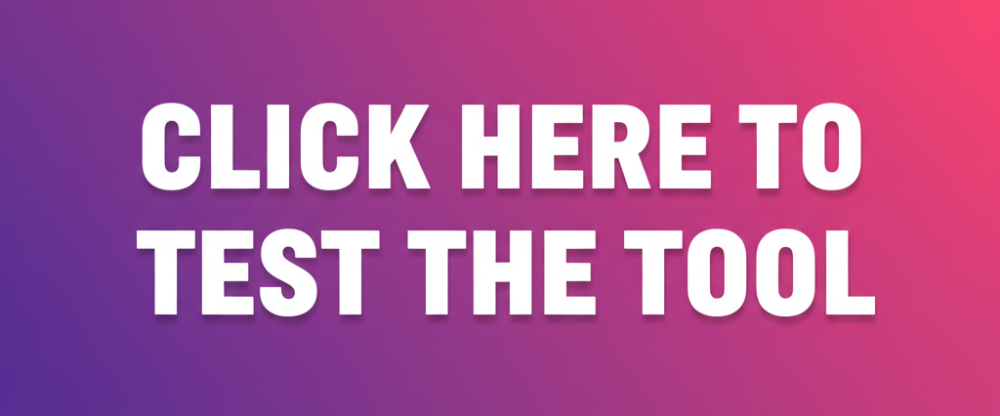

[](https://iroblivionspark.github.io/v2ray-link-parser/index.html)
<div align="center">
  <h1 align="center">V2Ray Link Parser To JSON</h1>
  <p align="center">A fast, online developer tool to parse various V2Ray/Xray protocol links (VMess, VLESS, SS, Trojan) into structured JSON configuration.</p>
  
  <p align="center">
    <a href="https://github.com/iroblivionspark/v2ray-link-parser/stargazers" target="_blank">
        
    </a>
    
    
  </p>
</div>

---

## 📖 Overview

The **V2Ray Link Parser To JSON** is a dedicated web utility designed to simplify the management and verification of V2Ray/Xray connection links. Instead of manually decoding complex URI formats, users can instantly convert these links into a clean, standard JSON configuration object.

This tool is invaluable for system administrators, developers, and power users who need to quickly inspect, modify, or integrate V2Ray link parameters.

## ✨ Key Features

* **Broad Protocol Support:** Handles all major V2Ray/Xray link formats:
    * **VLESS**
    * **VMess**
    * **Shadowsocks (SS)**
    * **Trojan**
* **Web-Based & Instant:** Available online, requiring no installation or complex setup.
* **Clean JSON Output:** Generates easily readable and copyable JSON.
* **Intuitive UI:** Features a modern, accessible interface with built-in Dark Mode (using Tailwind CSS).
* **Utility Actions:** Provides one-click buttons for copying the JSON and downloading it as a `.json` file.
* **Multilingual Support:** Includes English (EN) and Persian (FA) translation options.

## 🚀 Technologies Used

This project is built using modern front-end technologies to ensure speed and maintainability:

* **Frontend Library:** [React](https://react.dev/) (`^19.2.1`)
* **Build Tool:** [Vite](https://vitejs.dev/) (`^6.2.0`)
* **Language:** [TypeScript](https://www.typescriptlang.org/) (`~5.8.2`)
* **Styling:** [Tailwind CSS](https://tailwindcss.com/) (via CDN in `index.html`)
* **Icons:** [@heroicons/react](https://heroicons.com/)

## 💻 Local Setup and Installation

Follow these steps to set up the project environment locally.

### Prerequisites

You must have [Node.js](https://nodejs.org/) (which includes npm) installed on your system.

1.  **Clone the Repository:**
    ```bash
    git clone https://github.com/iroblivionspark/v2ray-link-parser.git
    cd v2ray-link-parser
    ```

2.  **Install Dependencies:**
    Install the required packages defined in `package.json`:
    ```bash
    npm install
    # or
    yarn install
    ```

3.  **Run in Development Mode:**
    Start the development server using Vite. [cite_start]The application will typically be accessible at `http://localhost:3000`. [cite: 1]
    ```bash
    npm run dev
    ```

### Production Build

To create optimized static files for deployment, use the build script:

```bash
npm run build
```

The optimized files will be generated in the dist directory.

💡 How to Use
Paste your V2Ray/Xray configuration link (e.g., vmess://..., vless://..., trojan://..., or ss://...) into the text area.

Click the "Convert to JSON" button.

The structured JSON output will appear in the right panel.

Use the Copy or Download buttons in the output panel for easy management.

🤝 Contribution
We welcome contributions! If you have suggestions for new features, improvements, or bug fixes, please feel free to:

Open an Issue to discuss potential changes.

Submit a Pull Request with your proposed code changes.

📄 License
This project is licensed under the MIT License.
